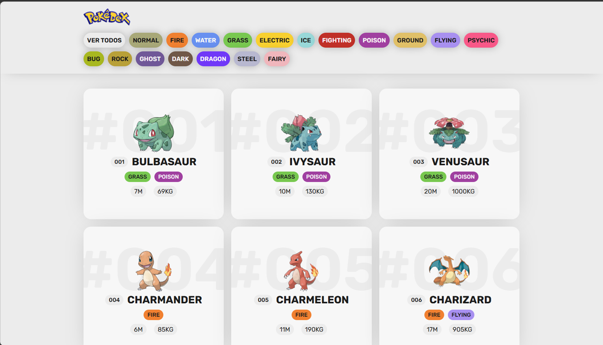

# Pokédex - PokeAPI 

<!-- 
<details>
<summary>Haz clic para ver más</summary>

🚀 **[Ver aplicación en vivo aquí](https://rcvunicun-lgtm.github.io/PokeAPI/)**
</details>
-->

## Descripción
Pokédex es una aplicación web interactiva diseñada para recibir, visualizar y filtrar datos de los primeros 151 Pokémon utilizando la API pública **PokéAPI**. La interfaz permite explorar información detallada como tipos, peso y altura, todo procesado en tiempo real mediante JavaScript asíncrono.

## Vista Previa



## Características principales
*   **Integración con PokéAPI:** Consumo dinámico de datos mediante protocolos REST y Fetch API.
*   **Filtrado en tiempo real:** Navegación por tipos elementales (Fuego, Agua, Eléctrico, etc.) con actualización inmediata de la interfaz.
*   **Visualización Detallada:** Renderizado de tarjetas que incluyen imágenes oficiales, estadísticas de peso/altura e identificadores formateados.
*   **Diseño Responsivo:** Layout adaptativo construido con CSS Grid y Flexbox para una experiencia óptima en móviles y escritorio.
*   **Tematización Dinámica:** Uso de variables CSS para cambiar el estilo visual según el tipo de Pokémon seleccionado.

## Estructura del proyecto

```text
├── css/
│   └── main.css        # Estilos, variables de color y layout responsivo
├── img/                # Recursos estáticos (Logo y assets)
├── js/
│   └── main.js         # Lógica de consumo de API y manipulación del DOM
├── index.html          # Estructura semántica y punto de entrada
└── descripcion.txt     # Objeto de metadatos del proyecto
```

## Requisitos del sistema
*   Navegador web moderno (Chrome, Firefox, Edge, Safari).
*   Conexión a internet (necesaria para las peticiones a la PokéAPI).

## Dependencias
*   **HTML5 & CSS3:** Para la estructura y el diseño visual sin frameworks externos.
*   **Vanilla JavaScript (ES6+):** Motor principal de la aplicación para el manejo de asincronía y el DOM.
*   **Google Fonts:** Integración de la fuente 'Rubik' para la tipografía del sistema.
*   **PokéAPI:** Fuente externa de datos para la información de las criaturas.

## Instalación y ejecución
### 1. Clonar el repositorio
Copia el proyecto a tu máquina local:
```bash
git clone https://github.com/rcvunicun-lgtm/PokeAPI.git
```

### 2. Ejecución local
No requiere compilación ni servidores complejos:
1. Navega a la carpeta del proyecto.
2. Abre el archivo `index.html` in tu navegador.
3. Se recomienda usar la extensión **Live Server** en VS Code para una mejor experiencia de desarrollo.

## Notas importantes
*   La lógica principal de arranque se encuentra en `js/main.js`.
*   El sistema carga automáticamente los primeros 151 Pokémon al iniciar.
*   Se utiliza un sistema de relleno de ceros (*padding*) para que los IDs siempre tengan 3 dígitos (ej: #001).

## Despliegue en la Web (Equivalente a Ejecutable)
Para compartir tu proyecto como una aplicación funcional en línea:
1. Sube el código a un repositorio de **GitHub**.
2. Ve a **Settings > Pages**.
3. En **Source**, selecciona `Deploy from a branch` y elige `main`.
4. GitHub te proporcionará una URL (ej: `https://tu-usuario.github.io/PokeAPI/`) que funciona como el acceso directo para cualquier usuario.

## Lo que aprendí con este proyecto
*   Consumo de APIs RESTful mediante `fetch` y manejo de promesas en JavaScript.
*   Manipulación dinámica del DOM para crear elementos de interfaz basados en datos externos.
*   Uso avanzado de **CSS Custom Properties** (Variables) para el manejo de temas de color dinámicos.
*   Estrategias de filtrado de datos en el cliente mediante métodos de arrays (`map`, `some`).
*   Optimización de diseño responsivo mediante sistemas de rejilla (Grid) y cajas flexibles (Flexbox).

## Autor
**Rodrigo Cantor Vasquez**
