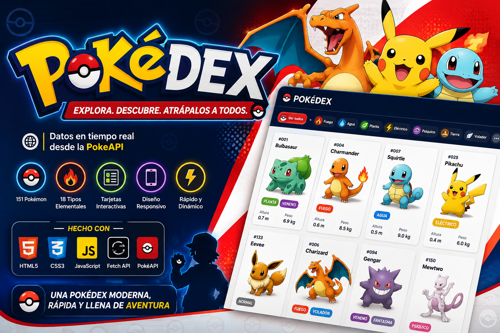

<p align="center">
  
</p>

# Pokédex - PokeAPI 


<!-- 
<details>
<summary>Haz clic para ver más</summary>

🚀 **[Ver aplicación en vivo aquí](https://rcvunicun-lgtm.github.io/PokeAPI/)**
</details>
-->

---

# 📖 Descripción

**Pokédex** es una aplicación web interactiva desarrollada en **Vanilla JavaScript** que consume la API pública **PokéAPI** para recibir, visualizar y filtrar en tiempo real los datos de los primeros 151 Pokémon.

El sistema realiza peticiones asíncronas mediante **Fetch API** hacia el endpoint `/pokemon/{id}` de PokéAPI, construye dinámicamente una tarjeta por cada criatura (imagen oficial, tipos, peso y altura) y permite filtrar el listado completo por tipo elemental desde la barra de navegación, sin necesidad de recargar la página.

---

# 🖼️ Vista previa


---

# ✨ Características principales

- 🌐 **Integración con PokéAPI:** Consumo dinámico de datos mediante protocolos REST y Fetch API.
- 🔍 **Filtrado en tiempo real:** Navegación por 18 tipos elementales (Fuego, Agua, Eléctrico, etc.) con actualización inmediata de la interfaz.
- 🃏 **Visualización detallada:** Renderizado de tarjetas con imágenes oficiales, estadísticas de peso/altura e identificadores formateados (`#001`, `#025`...).
- 📱 **Diseño responsivo:** Layout adaptativo construido con CSS Grid y Flexbox (1 → 2 → 3 columnas según el ancho de pantalla).
- 🎨 **Tematización dinámica:** Uso de variables CSS (`--type-*`) para colorear botones y etiquetas según el tipo de Pokémon.

---

# 📂 Estructura del proyecto

```
PokeAPI_FreeCodeCamp/
│
├── css/
│   └── main.css          # Variables de color por tipo, layout responsivo y estilos de tarjetas
│
├── img/                   # Recursos estáticos
│   ├── logo.png           # Logo de la app (header)
│   └── img1.png           # Captura de pantalla (README)
│
├── js/
│   └── main.js            # Consumo de PokéAPI, renderizado de tarjetas y lógica de filtrado
│
├── index.html             # Estructura semántica y punto de entrada
└── InfoCurso.txt           # Referencia al tutorial/curso base del proyecto
```

---

# 💻 Tecnologías utilizadas

## Frontend
- HTML5 (estructura semántica)
- CSS3 (Custom Properties, Grid, Flexbox, media queries)
- Vanilla JavaScript (ES6+)
- Fetch API + Promesas (`.then`)
- Google Fonts (tipografía 'Rubik')

## Arquitectura
- Sitio 100% estático y del lado del cliente: no requiere backend, base de datos ni proceso de build. Toda la lógica vive en `js/main.js` y se ejecuta directamente en el navegador.

---

# ⚙️ Funcionalidades del sistema

- ✔ Carga automática de los primeros 151 Pokémon al iniciar la aplicación (`for` de 1 a 151 disparando un `fetch` por cada ID).
- ✔ Renderizado dinámico de tarjetas mediante la función `mostrarPokemon(poke)`, que inyecta imagen, ID con padding de ceros, nombre, tipos y estadísticas.
- ✔ Filtrado por tipo: cada botón del header (`Fire`, `Water`, `Grass`...) limpia el listado y vuelve a consultar la API, mostrando solo los Pokémon cuyo arreglo de tipos incluye el tipo seleccionado (`Array.some`).
- ✔ Botón **"Ver todos"** para restablecer el listado completo.
- ✔ Sistema de relleno de ceros (*padding*) para que los IDs siempre tengan 3 dígitos (ej: `#001`).

---

# ⚙️ Requisitos

- Navegador web moderno (Chrome, Firefox, Edge, Safari).
- Conexión a internet (necesaria para las peticiones a la PokéAPI).

> No se requiere servidor, base de datos ni gestor de dependencias: el proyecto no usa frameworks ni npm.

---

# 🚀 Instalación

## 1. Clonar el repositorio
```bash
git clone https://github.com/rcvunicun-lgtm/PokeAPI.git
```

## 2. Ejecución local
No requiere compilación ni servidores complejos:
1. Navega a la carpeta del proyecto.
2. Abre el archivo `index.html` en tu navegador.
3. Se recomienda usar la extensión **Live Server** en VS Code para una mejor experiencia de desarrollo.

---

# 🧠 Arquitectura del proyecto

```
Usuario ──> index.html (carga) ──> main.js: for(1..151) ──> fetch PokeAPI ──> mostrarPokemon()
                                                                                     │
                                                                                     ▼
                                                                        Tarjetas renderizadas en #listaPokemon

Usuario ──> click en botón de tipo (header) ──> limpia #listaPokemon ──> repite fetch(1..151)
                                                                              │
                                                              filtra con Array.some(tipo) antes de renderizar
```

---

# 🌐 Despliegue en la Web (Equivalente a Ejecutable)

Para compartir tu proyecto como una aplicación funcional en línea:
1. Sube el código a un repositorio de **GitHub**.
2. Ve a **Settings > Pages**.
3. En **Source**, selecciona `Deploy from a branch` y elige `main`.
4. GitHub te proporcionará una URL (ej: `https://tu-usuario.github.io/PokeAPI/`) que funciona como el acceso directo para cualquier usuario.

---

# 🎯 Objetivos del proyecto

- Practicar el consumo de APIs RESTful públicas mediante `fetch` y el manejo de promesas en JavaScript.
- Reforzar la manipulación dinámica del DOM para construir interfaces a partir de datos externos.
- Explorar el uso de **CSS Custom Properties** para tematización dinámica según datos.
- Aplicar estrategias de filtrado de datos en el cliente mediante métodos de arrays (`map`, `some`).
- Practicar diseño responsivo con sistemas de rejilla (Grid) y cajas flexibles (Flexbox).

---

# 🧠 Conocimientos aplicados

Durante el desarrollo de este proyecto se consolidaron competencias en:
- Consumo de APIs RESTful mediante `fetch` y manejo de promesas encadenadas en JavaScript.
- Manipulación dinámica del DOM para crear elementos de interfaz basados en datos externos.
- Uso avanzado de **CSS Custom Properties** (variables) para el manejo de temas de color dinámicos.
- Estrategias de filtrado de datos en el cliente mediante métodos de arrays (`map`, `some`).
- Optimización de diseño responsivo mediante sistemas de rejilla (Grid) y cajas flexibles (Flexbox).

---

# 🚀 Mejoras futuras

- Migrar de `.then()` encadenados a `async/await` para mejorar la legibilidad del código.
- Evitar volver a consultar la API completa (151 peticiones) en cada filtro: guardar los datos ya obtenidos en memoria y filtrar localmente.
- Añadir manejo de errores (`.catch`) en las peticiones `fetch` ante fallos de red o de la API.
- Reemplazar el relleno manual de ceros (`if/else`) por `String.padStart(3, '0')`.
- Añadir un buscador por nombre y un estado de carga (*loading*) mientras se obtienen los datos.

---

# 👨‍💻 Autor

**Rodrigo Cantor Vasquez**
GitHub: https://github.com/rcvunicun-lgtm